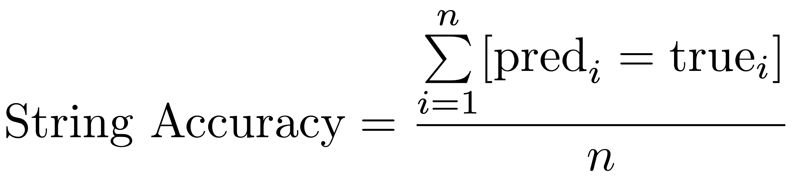

<p align="center">
  
</p>

# Digital Peter: recognition of Peter the Great's manuscripts

Русскую версию документа можно найти [тут](https://github.com/sberbank-ai/digital_peter_aij2020/blob/master/README.ru.md).

Digital Peter is an educational task with a historical slant created on the basis of several AI technologies (Computer Vision, NLP, and knowledge graphs). The task was prepared jointly with the Saint Petersburg Institute of History (N.P.Lihachov mansion) of Russian Academy of Sciences, Federal Archival Agency of Russia and Russian State Archive of Ancient Acts.

### Description of the task and data

Contestants are invited to create an algorithm for line-by-line recognition of manuscripts written by Peter the Great.

A detailed description of the problem (with an immersion in the problem) can be found in [```desc/detailed_description_of_the_task_en.pdf```](https://github.com/sberbank-ai/digital_peter_aij2020/blob/master/desc/detailed_description_of_the_task_en.pdf)

Train dataset can be downloaded [here](https://storage.yandexcloud.net/datasouls-ods/materials/46b7bb85/datasets.zip). This dataset was prepared jointly with a working group consisting of researchers from the Saint Petersburg Institute of History (N.P.Lihachov mansion) of Russian Academy of Sciences - specialists in the history of the Petrine era, as well as paleography and archeography. Federal Archival Agency of Russia and Russian State Archive of Ancient Acts were of great help by providing digital copies of autographs.

There are 2 folders inside: `images` and `words`. The `images` folder contains jpg files with cut lines from Peter the Great's documents, and the `words` folder contains txt files (transcribed versions of jpg files). Mapping is performed by name. 

For example,

the original text (1_1_10.jpg):
<p align="center">
  
</p>

the translation (1_1_10.txt):
```bash
                                  зело многа в гафѣ i непърестано выхо
```

File names have the following format `x_y_z`, where `x` is the series number (a series is a set of pages with text), `y` is the page number, and `z` is the line number on this page.
Absolute values `x`, `y`, `z` do not make any sense (these are internal numbers). Only the sequence `z` is important for fixed `x_y`. For example, in files 
```
  987_65_10.jpg
  987_65_11.jpg
  987_65_12.jpg
  987_65_13.jpg
  987_65_14.jpg
```
exactly 5 consecutive lines are found. 

Thus, by choosing certain values of `x` and `y`, it is possible to restore the sequence of lines in a particular document - these will be the numbers `z` in ascending order for fixed `x`, `y`. This fact can be used additionally to improve the quality of recognition.

The file names in the test dataset have the same structure.

The overwhelming majority of the lines were written by the hand of Peter the Great in the period from 1709 to 1713 (there are lines written in 1704, 1707 and 1708, but there are no more than 150 of them; these lines were included in both train dataset and test dataset).


### Baseline

Notebook with a baseline task:
[```baseline.ipynb```](https://github.com/sberbank-ai/digital_peter_aij2020/blob/master/baseline.ipynb)

For text recognition (in baseline), the following architecture is used:

<p align="center">
  
</p>

### Description of the metrics

The leaderboard will take into account the following recognition quality metrics (in the test dataset)

* **CER** - Character Error Rate 

<p align="center">
  
</p>

 is the Levenshtein distance calculated for character tokens (including spaces),  is the length of the string in characters.

* **WER** - Word Error Rate

<p align="center">
  
</p>

 is the Levenshtein distance calculated for word tokens,  - is the length of the string in words.

* **String Accuracy** - number of fully matching test strings divided by total number of test strings.

<p align="center">
  
</p>

Here we use Iverson bracket:
<p align="center">
  
</p>

In the formulas above,  is the size of the test sample,  is the string of characters that the model recognized in the -th image,  is the true translation of the -th image made by the expert.

Follow this [link](https://sites.google.com/site/textdigitisation/qualitymeasures/computingerrorrates) to learn more about the metrics.


You can learn more about the method of calculating metrics in the script [```eval/evaluate.py```](https://github.com/sberbank-ai/digital_peter_aij2020/blob/master/eval/evaluate.py). It accepts two parameters as input - [```eval/pred_dir```](https://github.com/sberbank-ai/digital_peter_aij2020/tree/master/eval/pred_dir) and [```eval/true_dir```](https://github.com/sberbank-ai/digital_peter_aij2020/tree/master/eval/true_dir). The [```eval/true_dir```](https://github.com/sberbank-ai/digital_peter_aij2020/tree/master/eval/true_dir) folder should contain txt-files with true strings translations (the structure is the same as in the `words` folder),  while the [```eval/pred_dir```](https://github.com/sberbank-ai/digital_peter_aij2020/tree/master/eval/pred_dir) folder should contain txt-files with recognized strings (using the model). Mapping is again done by name. So the lists of files’ names in the folders [```eval/true_dir```](https://github.com/sberbank-ai/digital_peter_aij2020/tree/master/eval/true_dir) and [```eval/pred_dir```](https://github.com/sberbank-ai/digital_peter_aij2020/tree/master/eval/pred_dir) **should be the same**!

The quality can be calculated using the following command  (called from the [```eval```](https://github.com/sberbank-ai/digital_peter_aij2020/tree/master/eval) folder):

```bash
python evaluate.py pred_dir true_dir
```

The result is displayed as follows:
```bash
Ground truth -> Recognized
[ERR:3] "Это соревнование посвящено" -> "Эт срвнование посвящено"
[ERR:3] "распознаванию строк из рукописей" -> "распознаваниюстр ок из рукписей"
[ERR:2] "Петра I" -> "Птра 1"
[OK] "Удачи!" -> "Удачи!"
Character error rate: 11.267606%
Word error rate: 70.000000%
String accuracy: 25.000000%
```

**CER**, %, is the key metric used to sort the leaderboard (the less the better). If two or more contestants earn the same **CER**, they will be sorted using **WER**, %, (the less the better). If both **CER** and **WER** match, **String Accuracy**, %, will be used (the more the better). Next metric is the **Time**, sec., - execution time for your model to process the test dataset on NVidia Tesla V100 (the less the better). If all the metrics match, then the first will be the solution loaded earlier in time (if everything is the same here, then we will sort alphabetically by command names).

The latest version of the model (see [```baseline.ipynb```](https://github.com/sberbank-ai/digital_peter_aij2020/blob/master/baseline.ipynb)) has the following values for quality metrics calculated on the public part of the test sample:
```bash
CER = 10.526%
WER = 44.432%
String Accuracy = 21.662%
Time = 60 sec
```

### Solution format

The accepted solution is ZIP archive, which contains the algorithm (your code) and the entrypoint to run it. The entrypoint should be set in `metadata.json` file in the root of your solution archive:

```
{
   "image": "<docker image>",
   "entrypoint": "<entry point or sh script>"
}
```

For example:
```
{
   "image": "odsai/python-gpu",
   "entrypoint": "python predict.py"
}
```

The data is supposed to be read from `/data` directory. Your predictions should go to `/output`. For each picture file from `/data` `<image_name>.jpg` you have to get the corresponding recognized text file `<image_name>.txt` in `/output`.

The solution is run in Docker container. You can start with the ready-to-go image we prepared https://hub.docker.com/r/odsai/python-gpu. It contains CUDA 10.1, CUDNN 7.6 and the latest Python libraries. Also you can use your own image for the competition, which must be uploaded to https://hub.docker.com. The image name is changed in hereabove mentioned `metadata.json`.


Provided resources:
- 8 CPU cores
- 94 GB RAM
- NVidia Tesla V100 GPU

Restrictions:
- Up to 5 GB size of the working dir
- Up to 5 GB size of an archive with the solution
- 10 minutes calculation time limit


You can download the example solution: [`submit_example`](https://github.com/sberbank-ai/digital_peter_aij2020/tree/master/submit_example)
