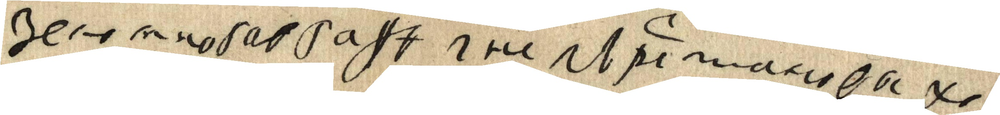
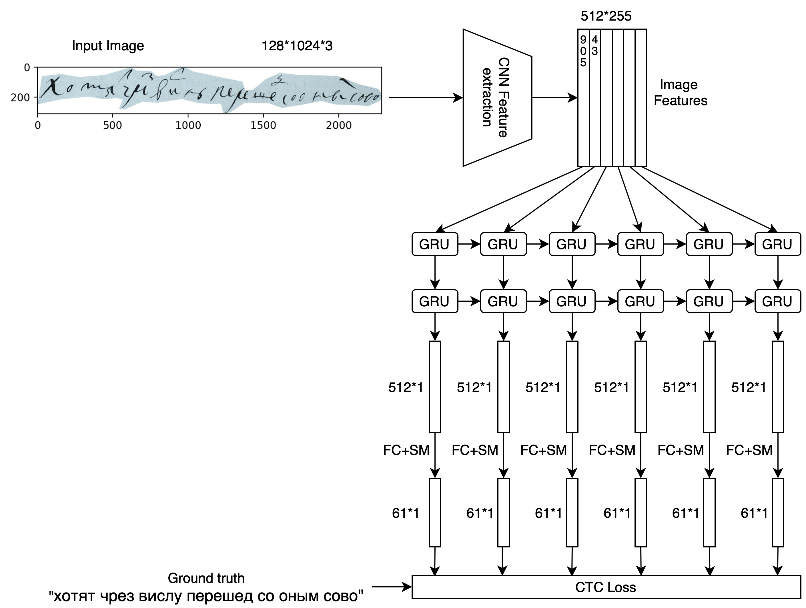
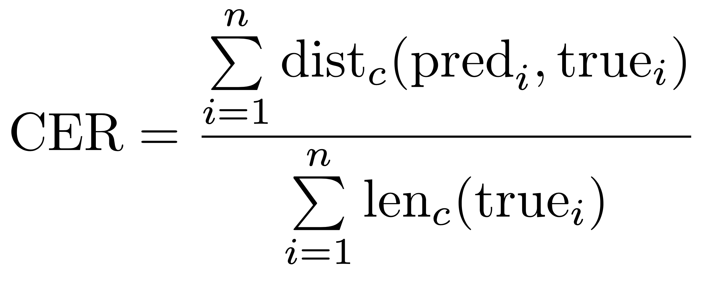
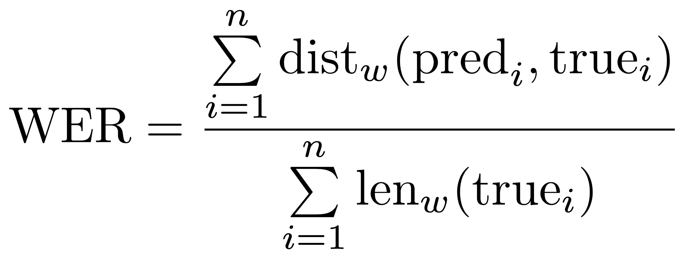
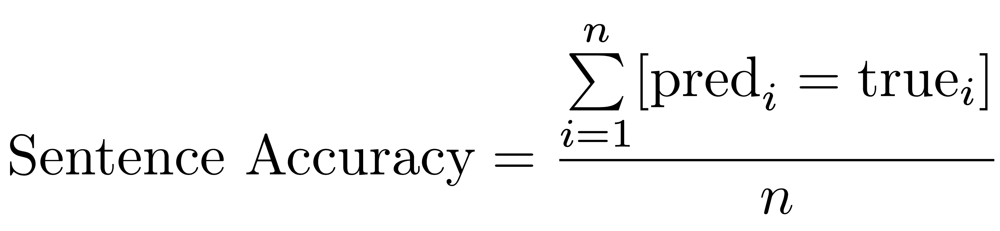
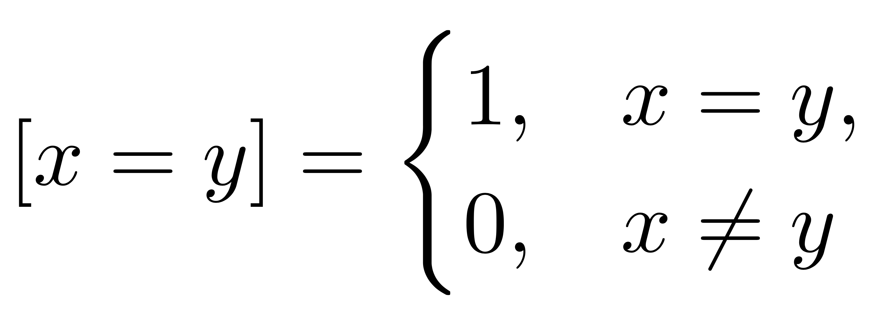

# AI Journey 2020 Digital Peter

Соревнование по распознаванию древних текстов, написанных рукой Петра Великого.

### Описание задачи и данных

Участникам предлагается построчно распознавать рукописный текст Петра I.

Развернутое описание задачи (с погружением в проблематику) можно прочитать в ```desc/Развернутое описание задачи.pdf```

Train выборку можно скачать [тут](https://drive.google.com/file/d/1kDmRCl692k6s9kQnNryq5ByAaHZX2uEw/view?usp=sharing).

Внутри находятся 2 папки:  ```images``` и ```words```. В папке ```images``` лежат jpg-файлы с вырезанными строками из документов Петра Великого, в папке ```words``` - txt-файлы (транскрибированные версии jpg-файлов). Маппинг осуществляется по названию.

Например, 

оригинал (1_1_10.jpg):
<p align="center">
  
</p>

его перевод (1_1_10.txt):
```bash
                                  зело многа в гафѣ i непърестано выхо
```

### Бейзлайн

Ноутбук с бейзлайном задачи:
```baseline.ipynb```

Для распознавания текста (в бейзлайне) используется следующая архитектура:

<p align="center">
  
</p>


### Описание метрик

В лидерборде будут учитываться следующие метрики качества распознавания (на тестовой выборке)

* **CER** - Character Error Rate 

<p align="center">
  
</p>

Здесь  - это расстояние Левенштейна, посчитанное для токенов-символов (включая пробелы),  - длина строки в символах.

* **WER** - Word Error Rate

<p align="center">
  
</p>

Здесь  - это расстояние Левенштейна, посчитанное для токенов-слов,  - длина строки в словах.

* **Sentence Accuracy** - отношение количества полностью совпавших строк к количеству строк в выборке.

<p align="center">
  
</p>

В этой формуле используется скобка Айверсона:
<p align="center">
  
</p>

В формулах выше  - размер тестовой выборки,  - это строка из символов, которую распознала модель на -ом изображении, а  - это истинный перевод -ого изображения, произведенный экспертом.


Про метрики дополнительно можно прочитать [тут](https://sites.google.com/site/textdigitisation/qualitymeasures/computingerrorrates). 

Методику подсчета метрик можно изучить подробнее в скрипте ```eval/evaluate.py```. Он принимает на вход два параметра - ```eval/pred_dir``` и ```eval/true_dir```. В папке ```eval/true_dir``` должны находиться txt-файлы с истинным переводом строк (структура как в папке ```words```), в папке ```eval/pred_dir``` - txt-файлы, содержащие распознанные (моделью) строки. Маппинг опять же осуществляется по названию, поэтому списки названий файлов в папках ```eval/true_dir``` и ```eval/pred_dir``` **должны полностью совпадать**!

Качество можно посчитать следующей командой (вызванной из папки ```eval```):

```bash
python evaluate.py pred_dir true_dir
```

Результат отображается в следующем виде:
```bash
Ground truth -> Recognized
[ERR:3] "Это соревнование посвящено" -> "Эт срвнование посвящено"
[ERR:3] "распознаванию строк из рукописей" -> "распознаваниюстр ок из рукписей"
[ERR:2] "Петра I" -> "Птра 1"
[OK] "Удачи!" -> "Удачи!"
Character error rate: 11.267606%
Word error rate: 70.000000%
String accuracy: 25.000000%
```

Главная метрика, по которой сортируется лидерборд, - **CER** (меньше - лучше). В случае совпадения **CER** у двух или более участников, сортировка для них будет вестись по **WER** (меньше - лучше). Если и **CER**, и **WER** совпадают, - смотрим на **Sentence Accuracy** (больше - лучше). Если все метрики сопадают, тогда первым будет решение, загруженное раньше по времени (если и тут все совпадает, то сортируем по алфавиту по названиям команд).

Последняя версия модели (см. бейзлайн) имеет следующие значения метрик качества, посчитанных на public-части тестовой выборки:
```bash
CER = 10.525554%
WER = 44.431804%
String Accuracy = 21.662304%
```
### Отправка решения

В данный момент в репозитории находятся ссылка на данные и бейзлайн модели для обучения. Подробная инструкция по сабмиту будет предоставлена в ближайшее время.
